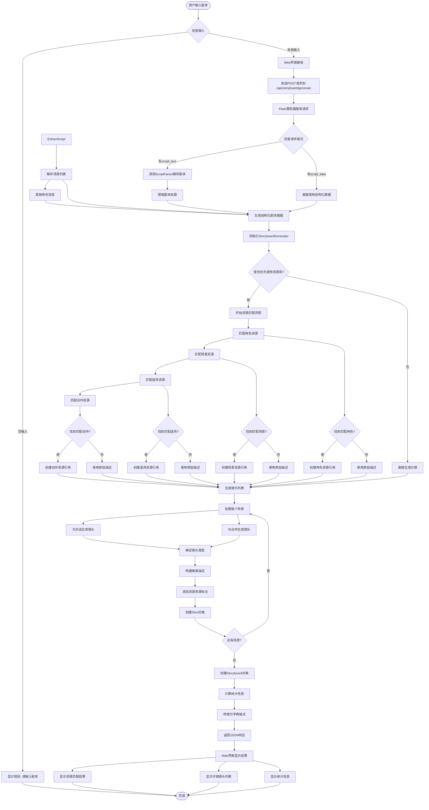

# 剧本到分镜生成流程图

## 完整流程图



## 详细步骤说明

### 阶段1: 用户输入与接收

```
┌─────────────────────────────────────────┐
│  1. 用户输入剧本                          │
│     - 在Web界面输入剧本文本               │
│     - 可选：设置剧本标题                  │
│     - 选择：是否优先使用资源库资源        │
└─────────────────────────────────────────┘
                    ↓
┌─────────────────────────────────────────┐
│  2. Web前端处理                          │
│     - 验证输入（非空检查）                │
│     - 显示加载状态                        │
│     - 发送POST请求到API                  │
└─────────────────────────────────────────┘
```

### 阶段2: 服务器接收与解析

```
┌─────────────────────────────────────────┐
│  3. Flask服务器接收请求                  │
│     POST /api/storyboard/generate       │
│     {                                   │
│       "script_text": "...",             │
│       "title": "...",                   │
│       "prefer_existing_resources": true │
│     }                                   │
└─────────────────────────────────────────┘
                    ↓
┌─────────────────────────────────────────┐
│  4. 剧本解析 (ScriptParser)              │
│     ├─ 提取标题                          │
│     ├─ 解析场景列表                      │
│     │   ├─ 识别场景标记                  │
│     │   ├─ 提取地点、时间                │
│     │   ├─ 解析对话                      │
│     │   ├─ 解析动作                      │
│     │   └─ 提取备注                      │
│     └─ 提取角色信息                      │
└─────────────────────────────────────────┘
                    ↓
┌─────────────────────────────────────────┐
│  5. 生成结构化剧本数据                   │
│     {                                   │
│       "title": "剧本标题",              │
│       "scenes": [                       │
│         {                               │
│           "scene_number": 1,            │
│           "location": "场景地点",        │
│           "time": "时间",                │
│           "characters": ["角色1"],       │
│           "dialogue": [...],            │
│           "action": "动作描述",          │
│           "notes": "备注"                │
│         }                               │
│       ],                                 │
│       "characters": {                   │
│         "角色1": {                       │
│           "description": "...",         │
│           "appearance": "..."            │
│         }                               │
│       }                                 │
│     }                                   │
└─────────────────────────────────────────┘
```

### 阶段3: 资源匹配（如果启用）

```
┌─────────────────────────────────────────┐
│  6. 初始化资源匹配器                     │
│     ResourceMatcher(asset_manager)      │
└─────────────────────────────────────────┘
                    ↓
        ┌───────────┴───────────┐
        ↓                       ↓
┌───────────────┐      ┌───────────────┐
│ 匹配角色资源   │      │ 匹配场景资源   │
│               │      │               │
│ 1. 搜索角色   │      │ 1. 搜索场景   │
│ 2. 名称匹配   │      │ 2. 类型匹配   │
│ 3. 描述匹配   │      │ 3. 氛围匹配   │
│ 4. 标签匹配   │      │ 4. 时间匹配   │
│ 5. 风格匹配   │      │ 5. 天气匹配   │
│ 6. 计算分数   │      │ 6. 计算分数   │
└───────────────┘      └───────────────┘
        ↓                       ↓
        └───────────┬───────────┘
                    ↓
        ┌───────────┴───────────┐
        ↓                       ↓
┌───────────────┐      ┌───────────────┐
│ 匹配道具资源   │      │ 匹配动作资源   │
│               │      │               │
│ 1. 搜索道具   │      │ 1. 搜索动作   │
│ 2. 名称匹配   │      │ 2. 类型匹配   │
│ 3. 类别匹配   │      │ 3. 名称匹配   │
│ 4. 计算分数   │      │ 4. 计算分数   │
└───────────────┘      └───────────────┘
                    ↓
┌─────────────────────────────────────────┐
│  7. 创建资源引用 (ResourceReference)     │
│     {                                   │
│       "resource_id": "xxx",            │
│       "resource_type": "character",    │
│       "resource_name": "角色名",       │
│       "match_score": 0.85,            │
│       "match_reason": "名称相似度..."   │
│     }                                   │
└─────────────────────────────────────────┘
```

### 阶段4: 分镜生成

```
┌─────────────────────────────────────────┐
│  8. 初始化分镜生成器                     │
│     StoryboardGenerator(asset_manager)  │
└─────────────────────────────────────────┘
                    ↓
┌─────────────────────────────────────────┐
│  9. 遍历场景，生成镜头                   │
│     for scene in scenes:                │
│       ├─ 匹配场景资源                   │
│       ├─ 匹配角色资源                   │
│       └─ 生成镜头                       │
└─────────────────────────────────────────┘
                    ↓
┌─────────────────────────────────────────┐
│  10. 为每个场景生成镜头                  │
│      ├─ 处理对话                        │
│      │   ├─ 为每个对话生成一个镜头       │
│      │   ├─ 确定镜头类型（特写/中景）   │
│      │   └─ 提取情绪信息                │
│      │                                  │
│      └─ 处理动作                        │
│          └─ 生成动作镜头                │
└─────────────────────────────────────────┘
                    ↓
┌─────────────────────────────────────────┐
│  11. 构建镜头描述                        │
│      描述格式:                          │
│      "场景: XXX（来自资源库） |          │
│       角色: YYY（来自资源库） |          │
│       动作: ZZZ |                       │
│       对话: ..."                        │
└─────────────────────────────────────────┘
                    ↓
┌─────────────────────────────────────────┐
│  12. 创建Shot对象                        │
│      {                                  │
│        "shot_number": 1,                │
│        "scene_number": 1,               │
│        "shot_type": "close-up",        │
│        "duration": 3.0,                 │
│        "description": "...",           │
│        "camera_angle": "正面平视",      │
│        "characters": ["角色1"],         │
│        "dialogue": "对话内容",          │
│        "transition": "cut",           │
│        "visual_style": "写实",          │
│        "character_resources": [...],   │
│        "scene_resource": {...},         │
│        "prop_resources": [...],         │
│        "action_resources": [...]        │
│      }                                  │
└─────────────────────────────────────────┘
```

### 阶段5: 结果组装与返回

```
┌─────────────────────────────────────────┐
│  13. 创建Storyboard对象                 │
│      {                                  │
│        "title": "剧本标题",             │
│        "shots": [Shot1, Shot2, ...],    │
│        "metadata": {                    │
│          "total_duration": 30.0,        │
│          "total_shots": 10,             │
│          "source": "script",            │
│          "prefer_existing_resources":   │
│            true                         │
│        }                                │
│      }                                  │
└─────────────────────────────────────────┘
                    ↓
┌─────────────────────────────────────────┐
│  14. 转换为字典格式                      │
│      storyboard.to_dict()               │
└─────────────────────────────────────────┘
                    ↓
┌─────────────────────────────────────────┐
│  15. 返回JSON响应                        │
│      {                                  │
│        "success": true,                 │
│        "data": {...},                   │
│        "message": "分镜脚本生成成功"     │
│      }                                  │
└─────────────────────────────────────────┘
```

### 阶段6: 前端展示

```
┌─────────────────────────────────────────┐
│  16. Web界面接收响应                    │
│      - 解析JSON数据                      │
│      - 隐藏加载状态                      │
└─────────────────────────────────────────┘
                    ↓
        ┌───────────┴───────────┐
        ↓                       ↓
┌───────────────┐      ┌───────────────┐
│ 显示资源匹配   │      │ 显示分镜脚本   │
│               │      │               │
│ - 场景资源    │      │ - 统计信息    │
│ - 角色资源    │      │ - 镜头列表    │
│ - 道具资源    │      │ - 资源标注    │
│ - 动作资源    │      │ - 导出功能    │
│ - 匹配分数    │      │               │
└───────────────┘      └───────────────┘
```

## 关键算法流程

### 资源匹配算法

```
角色匹配流程:
┌─────────────────────────────────────┐
│ 1. 搜索资源库                       │
│    search_resources(                │
│      keyword=角色名,                │
│      tags=标签,                     │
│      resource_type=CHARACTER        │
│    )                                │
└─────────────────────────────────────┘
            ↓
┌─────────────────────────────────────┐
│ 2. 风格过滤                         │
│    if style:                        │
│      filter by style                │
└─────────────────────────────────────┘
            ↓
┌─────────────────────────────────────┐
│ 3. 计算匹配分数                      │
│    名称相似度 × 0.4                 │
│    + 描述相似度 × 0.3               │
│    + 标签匹配度 × 0.2                │
│    + 风格匹配 × 0.1                 │
│    = 总分 (0-1)                     │
└─────────────────────────────────────┘
            ↓
┌─────────────────────────────────────┐
│ 4. 选择最佳匹配                      │
│    if 分数 >= min_score (0.3):      │
│      return (角色, ResourceReference)│
│    else:                            │
│      return None                     │
└─────────────────────────────────────┘
```

### 镜头生成算法

```
镜头生成流程:
┌─────────────────────────────────────┐
│ 1. 遍历场景                        │
│    for scene in scenes:            │
└─────────────────────────────────────┘
            ↓
┌─────────────────────────────────────┐
│ 2. 匹配资源                        │
│    - 匹配场景资源                   │
│    - 匹配角色资源                   │
│    - 匹配道具资源                   │
│    - 匹配动作资源                   │
└─────────────────────────────────────┘
            ↓
┌─────────────────────────────────────┐
│ 3. 处理对话                        │
│    for dialogue in scene.dialogue: │
│      - 确定镜头类型                 │
│      - 构建描述                     │
│      - 创建Shot对象                 │
└─────────────────────────────────────┘
            ↓
┌─────────────────────────────────────┐
│ 4. 处理动作                        │
│    if scene.action:                │
│      - 确定镜头类型                 │
│      - 构建描述                     │
│      - 创建Shot对象                 │
└─────────────────────────────────────┘
            ↓
┌─────────────────────────────────────┐
│ 5. 添加资源引用                    │
│    shot.character_resources = [...] │
│    shot.scene_resource = {...}     │
│    shot.prop_resources = [...]      │
│    shot.action_resources = [...]    │
└─────────────────────────────────────┘
```

## 数据流转图

```
用户输入
  │
  ↓
剧本文本 (纯文本)
  │
  ↓ [ScriptParser.parse()]
结构化剧本数据 (JSON)
  │
  ↓ [ResourceMatcher.match_*()]
资源引用列表 (ResourceReference[])
  │
  ↓ [StoryboardGenerator.generate_from_script()]
分镜脚本对象 (Storyboard)
  │
  ↓ [Storyboard.to_dict()]
分镜脚本字典 (Dict)
  │
  ↓ [JSON响应]
前端接收 (JSON)
  │
  ↓ [前端渲染]
可视化展示 (HTML)
```

## 关键数据结构

### 输入数据结构
```python
# 用户输入的剧本文本
script_text: str

# 或结构化剧本数据
script_data: {
    "title": str,
    "scenes": [
        {
            "scene_number": int,
            "location": str,
            "time": str,
            "characters": [str],
            "dialogue": [
                {
                    "character": str,
                    "text": str,
                    "emotion": str
                }
            ],
            "action": str,
            "notes": str
        }
    ],
    "characters": {
        "角色名": {
            "description": str,
            "appearance": str
        }
    }
}
```

### 输出数据结构
```python
# 分镜脚本
storyboard: {
    "title": str,
    "storyboard": [
        {
            "shot_number": int,
            "scene_number": int,
            "shot_type": str,
            "duration": float,
            "description": str,  # 包含资源来源标注
            "camera_angle": str,
            "characters": [str],
            "dialogue": str,
            "transition": str,
            "visual_style": str,
            "character_resources": [
                {
                    "resource_id": str,
                    "resource_type": str,
                    "resource_name": str,
                    "match_score": float,
                    "match_reason": str
                }
            ],
            "scene_resource": {...},
            "prop_resources": [...],
            "action_resources": [...]
        }
    ],
    "metadata": {
        "total_duration": float,
        "total_shots": int,
        "source": str,
        "prefer_existing_resources": bool
    }
}
```

## 错误处理流程

```
┌─────────────────────────────────────┐
│ 错误类型                            │
├─────────────────────────────────────┤
│ 1. 输入错误                         │
│    - 剧本文本为空                   │
│    → 返回400错误                    │
│                                     │
│ 2. 解析错误                         │
│    - 剧本格式无法识别               │
│    → 使用默认场景                   │
│                                     │
│ 3. 资源匹配错误                     │
│    - 资源库访问失败                 │
│    → 跳过资源匹配，使用原始描述     │
│                                     │
│ 4. 生成错误                         │
│    - 分镜生成异常                   │
│    → 返回500错误，包含错误信息      │
└─────────────────────────────────────┘
```

## 性能优化点

1. **资源匹配优化**
   - 缓存资源列表，避免重复查询
   - 使用索引加速搜索

2. **并行处理**
   - 场景处理可以并行化
   - 资源匹配可以并行进行

3. **增量生成**
   - 支持增量添加镜头
   - 支持修改已有镜头

## 扩展点

1. **AI增强**
   - 使用LLM优化剧本解析
   - 使用LLM优化资源匹配
   - 使用LLM生成更丰富的描述

2. **可视化**
   - 生成分镜预览图
   - 3D场景预览

3. **协作**
   - 多人编辑分镜
   - 版本控制

